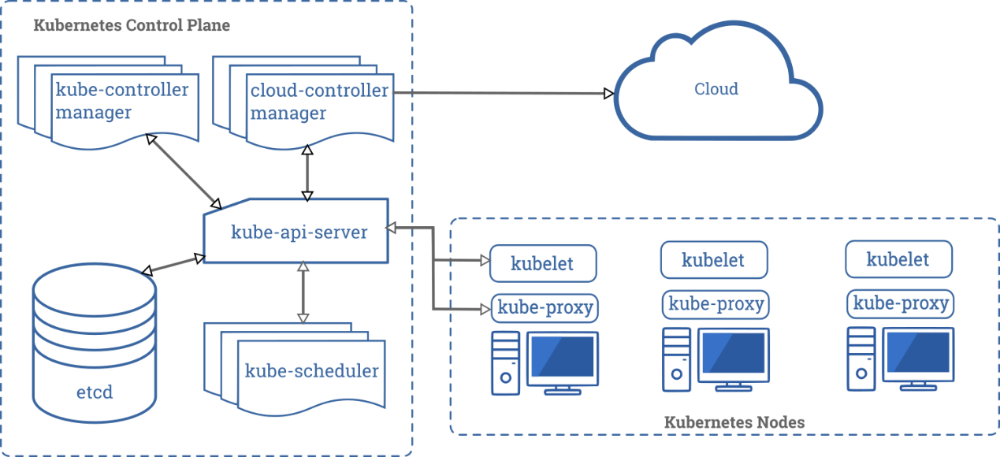
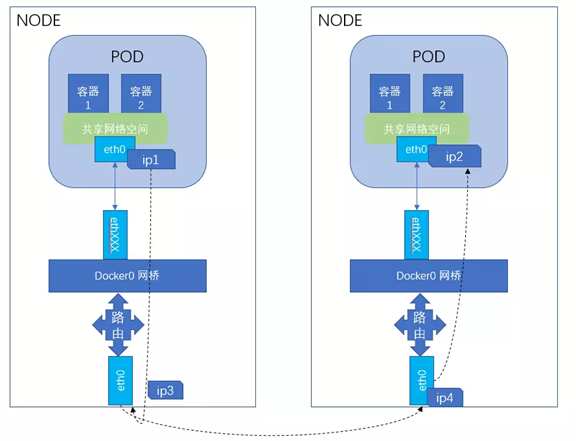
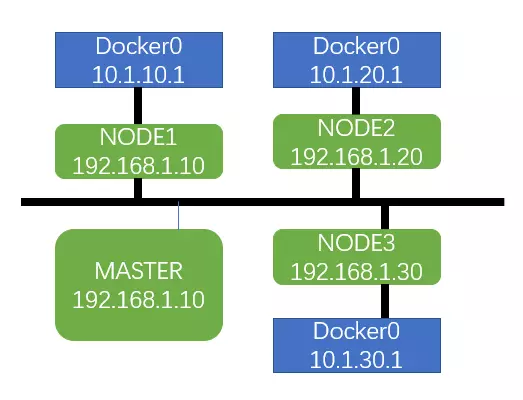
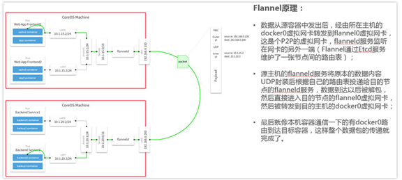
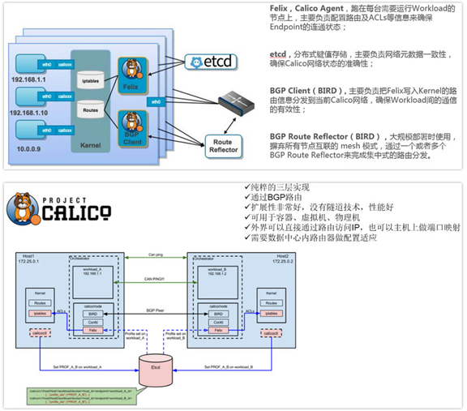

# k8s 相关

# 一、相关概念 

[k8s components](https://kubernetes.io/docs/concepts/overview/components/)

​		Kubernetes 是一个开源容器编排引擎，用于容器化应用的自动化部署、扩展、管理、自动扩缩容、维护等功能。k8s 最核心的两个设计理念容错性和易扩展性，容错性保证 k8s 系统稳定性和安全性的基础，易扩展性是保证  k8s 对变更友好，可以快速迭代增加新功能的基础。

功能：

- 快速部署应用（自动化容器部署和复制）
- 快速扩展应用（随时扩展或收缩容器规模）
- 无缝对接新应用功能（很容易升级应用到新版本）
- 提供容器弹性，如果容器失效就替换它
- 将容器组织成组，并提供容器间的负载均衡
- 节省资源，优化硬件资源的使用

特点：

- 可移植：支持公有云、私有云、混合云、多重云（muti-cloud）
- 可扩展：模块化、插件化、可挂载、可组合
- 自动化：自动部署、自动重启、自动复制、自动伸缩/扩展

优势：

- 容器编排
- 轻量级
- 开源
- 弹性伸缩
- 负载均衡




#### 控制平面组件：

| 名称                    | 说明                                                         |
| ----------------------- | ------------------------------------------------------------ |
| API Server              | API服务是控制平面的访问入口                                  |
| Etcd                    | 保存集群数据的键值对存储服务                                 |
| Scheduler               | 调度Pod在工作节点上运行                                      |
| kube-controllermanager  | 管理云平台无关的控制器                                       |
| cloud-controllermanager | 管理所有与云平台相关的控制器，这是为了把云平台相关的代码与k8s自身进行分离 |

#### 节点平面组件：

| 名称              | 说明                         |
| ----------------- | ---------------------------- |
| kubelet           | 确保Pod中的容器运行正常      |
| kube-proxy        | 用来实现服务的网络代理       |
| container runtime | 负责运行容器的软件，如Docker |

#### 核心思想

- 资源注册
- 发现框架

#### Pod

k8s 基本调度单元，表示由一个或多个容器组成的分组。Pod 里面的容器共享一些资源，包括存储、网络和每个容器的运行配置。每个 Pod 都有唯一的 IP 地址，其中的容器共享同一个 IP 地址和端口范围，相互之间可以通过 localhost 访问。Pod 还可以使它的容器访问其定义的共享的存储卷（volume），通过这种方式，可以实现 Pod 容器之间的数据共享。

#### 副本集（ReplicaSet）

保证在任何时候都有给定数量的Pod副本。当创建副本集时需要指定一个创建Pod的模板，同时确定Pod的选择器，并给出期望的Pod副本数量。在运行时，副本集根据指定的Pod选择器来监控当前Pod副本的数量，如果副本数量小于期望值，则根据Pod模板来创建新的Pod。一般用标签作为Pod的选择器。目的是维护一组在任何时候都处于运行状态的 Pod 副本的稳定集合。 它通常用来保证给定数量的、完全相同的 Pod 的可用性。建议使用 Deployment 而不是直接使用 ReplicaSet，除非需要自定义更新业务流程或根本不需要更新。这实际上意味着，可能永远不需要操作 ReplicaSet 对象，而是使用 Deployment，并在 spec 部分定义应用。

#### 部署（Deployment）

部署在副本集上提供对Pod的更新功能，每个部署都有对应的副本集。当部署中创建的Pod模板发生变化时，这些Pod都需要被更新。在更新时，k8s会创建一个新的副本集来管理新的Pod，当更新完后，旧的副本集会被删除。部署可以采用不同的策略来更新这些Pod，最常用的策略是滚动更新，它可以保证在更新过程中服务不间断。在进行滚动更新时，k8s首先会创建新的副本集中的Pod，再删除已有副本集中的Pod。这个过程是交替进行的 ，在没有足够数量的新Pod运行之前，不会删除已有的Pod。同样的，在没有足够数量的已有Pod被删除之前，不会创建新的Pod。控制器为 Pods 和 ReplicaSets 提供声明式的更新能力。负责描述 Deployment 中的目标状态，而 Deployment 控制器以受控速率更改实际状态， 使其变为期望状态。可以定义 Deployment 以创建新的 ReplicaSet，或删除现有 Deployment， 并通过新的 Deployment 收养其资源。

#### 有状态集（StatefulSet）

副本集中的 Pod 没有标识符，不能进行区分，它唯一保证的是所包含的 Pod 总数。有些应用对运行的实例有启动顺序和唯一性的要求，典型的例子是通过多个实例组成集群的服务，如 Cassandra 和 RabbitMQ 等。这些应用要求实例有固定且唯一的网络标识，才能正确的建立集群，对于这样的应用，应该使用有状态集来管理。有状态集中的 Pod 都有唯一不变的标识符，这个标识符由有状态集的名称和 Pod 的序号组成。如果有状态集的名称是 cassandra，同时期望的 Pod 副本数量是 3，那么 Pod 的名称分别是 cassandra-0、cassandra-1 和 cassandra-2。有状态集需要一个对应的服务来提供 Pod 的 DNS 名称。有状态集在创建和扩展时有特殊的限制，如果一个有状态集期望的 Pod 副本数量是 N，那么有状态集会从 0 开始依次创建这些 Pod，在第 1 个 Pod 正常运行之前，不会创建第 2 个Pod；在删除 Pod 时，则是从第 N 个 Pod 开始反向依次删除。是用来管理有状态应用的工作负载 API 对象。StatefulSet 用来管理某 Pod 集合的部署和扩缩， 并为这些 Pod 提供持久存储和持久标识符。StatefulSet 为它们的每个 Pod 维护了一个有粘性的 ID。这些 Pod 是基于相同的规约来创建的， 但是不能相互替换：无论怎么调度，每个 Pod 都有一个永久不变的 ID。如果希望使用存储卷为工作负载提供持久存储，可以使用 StatefulSet 作为解决方案的一部分。 尽管 StatefulSet 中的单个 Pod 仍可能出现故障，但持久的 Pod 标识符使得将现有卷与替换已失败 Pod 的新 Pod 相匹配变得更加容易。弊端：当删除 StatefulSets 时，StatefulSet 不提供任何终止 Pod 的保证。 为了实现 StatefulSet 中的 Pod 可以有序地且体面地终止，可以在删除之前将 StatefulSet 缩放为0，在默认 Pod 管理策略(OrderedReady) 时使用滚动更新，可能进入需要人工干预才能修复的损坏状态。

#### 守护程序集（DaemonSet）

守护程序集确保在全部或部分的集群节点上运行 Pod，每个节点上最多运行一个 Pod 副本。如果应用需要执行的任务与节点相关，则应该使用守护程序集，比如收集日志和节点性能指标数据的应用，都应该使用守护程序集来部署。确保全部（或者某些）节点上运行一个 Pod 的副本。 当有节点加入集群时， 也会为他们新增一个 Pod 。 当有节点从集群移除时，这些 Pod 也会被回收。删除 DaemonSet 将会删除它创建的所有 Pod。DaemonSet 与 Deployments 非常类似， 它们都能创建 Pod，并且 Pod 中的进程都不希望被终止（例如，Web 服务器、存储服务器）。建议为无状态的服务使用 Deployments，比如前端服务。对这些服务而言，对副本的数量进行扩缩容、平滑升级，比精确控制 Pod 运行在某个主机上要重要得多。 当需要 Pod 副本总是运行在全部或特定主机上，并需要它们先于其他 Pod 启动时， 应该使用 DaemonSet。

#### 服务（Service）

应用在运行时经常需要为其他应用提供服务。在使用控制器管理应用的 Pod 时，Pod 的 IP 地址会随着 Pod 的创建和删除而发生变化。因此，我们不能使用 Pod 的 IP 地址作为访问服务的方式。Kubernetes 中的服务（Service）作为一组 Pod 的抽象，定义了如何访问这些 Pod，它实现了服务发现和负载均衡两项重要的功能。在创建服务时需通过选择器来选择服务所对应的 Pod，应用服务的消费者使用服务的地址来访问 Pod，实际的访问请求会被分发到服务所对应的某个 Pod 上。当 Pod 发生变化时，服务会自动更新所对应的 Pod 列表。

|     名称     |     类型     |                      说明                      |
| :----------: | :----------: | :--------------------------------------------: |
|  集群IP地址  |  ClusterIP   | 服务发布为集群内部的IP地址，只能在集群内部访问 |
|   节点端口   |   NodePort   |         服务发布在每个节点上的固定端口         |
| 负载均衡服务 | LoadBalancer |      服务发布为可供外部访问的负载均衡服务      |
|   外部名称   | ExternalName |               服务映射成外部名称               |

#### 存储卷：

容器运行时对内部文件所做的修改是瞬时的，当容器停止之后，相关的修改会丢失。Kubernetes 提供了两个对象，即持久卷和持久卷要求，持久卷可以由管理员手动创建，或者由存储服务动态创建，用户则以持久卷要求的形式来声明所需要使用的持久卷的大小和访问模式；持久卷要求可以与手动创建的持久卷进行绑定，如果需要动态创建，则由存储服务完成创建之后，再进行绑定。一旦完成绑定，持久卷可以用类似卷的方式来访问。

#### 任务和定时任务：

当需要执行一次性任务时，我们可以使用任务对象在创建任务时指定需要运行的 Pod 模板。当需要定期执行任务时，则可以使用定时任务对象，在创建时，需要指定定时任务的 cron 表达式。

#### 配置表（ConfigMap）：

当它运行在 Kubernetes 上时，应该使用配置表（ConfigMap）来管理配置。配置表可以看成是包含名值对的哈希表。

#### 容器运行时（Container Runtime）：

支持多个容器运行环境: Docker、 containerd、cri-o、 rktlet 以及任何实现 Kubernetes CRI (容器运行环境接口)。

#### Master节点

##### ControllerManager

* 集群内各种资源controller的核心管理者
* 针对每一种具体的资源，都有相应的Controller
* 保证其下管理的每个Controller所对应的的资源始终处于“期望状态”

作为基本的运行单元，Pod缺少响应的管理功能。如果一个Pod在运行中出现错误，并不会自动创建新的Pod来替代它。如果需要管理Pod，则应该利用k8s提供不同类别的控制器，包括副本集、部署、有状态集合守护进程集。在主节点上运行控制器组件，从逻辑上讲，每个控制器都是一个单独的进程，但是为了减低复杂性，它们都会被编译到同一个可执行文件，并在一个进程中运行。

这些控制器包括：

- 节点控制器（Node Controller）：负责在节点出现故障时进行通知和响应。
- 副本控制器（Replication Controller）：负责为系统中的每个副本控制器对象维护正确数量的Pod。
- 端点控制器（Endpoint Controller）：填充端点对象（即加入Service与Pod）。
- 服务账户和令牌控制器（Service Account & Token Controllers）：为新的命名空间创建默认账户和API访问令牌。

##### API Server

* 集群控制的唯一入口，是提供 Kubernetes 集群控制 RESTful API 的核心组件
* 集群内各个组件之间数据交互和通信的中枢
* 提供集群控制的安全机制（身份认证、授权以及admission control）

##### Scheduler

* 通过API Server的Watch接口监听新建Pod副本信息，并通过调度算法为该Pod选择一个最合适的Node
* 支持自定义调度算法provider
* 默认调度算法内置预选策略和优选策略，决策考量资源需求、服务质量、软硬件约束、亲缘性、数据局部性等指标参数

##### Etcd

* Kubernetes集群的主数据库，存储着所有资源对象以及状态
* 默认与Master组件部署在一个Node上
* Etcd的数据变更都是通过API Server进行

#### Node节点

> kubernets集群中真正的工作负载节点

* ##### Kubelet

  * 位于集群中每个Node上的非容器形式的服务进程组件，Master和Node之间的桥梁
  * 处理Master下发到本Node上的Pod创建、启停等任务管理任务；向API Server注册Node信息
  * 监控本Node上容器和节点资源情况，并定期向Master汇报节点资源占用情况

* ##### Kube-proxy

  * Service抽象概念的实现，将到Service的请求按策略（负载均衡）算法分发到后端Pod（Endpoint）上
  * 默认使用iptables mode实现
  * 支持nodeport模式，实现从外部访问集群内的service
  
  * 容器运行时（Container Runtime）：支持多个容器运行环境: Docker、 containerd、cri-o、 rktlet 以及任何实现 Kubernetes CRI (容器运行环境接口)。

#### k8s核心组件

| 组件名             | 说明                                                         |
| ------------------ | ------------------------------------------------------------ |
| etcd               | 保存整个集群的状态                                           |
| apiserver          | 提供资源操作的唯一入口，并提供认证、授权、访问控制、api注册和发现等机制 |
| controller manager | 负责维护集群状态，比如故障检测、自动扩展、滚动更新等         |
| scheduer           | 负责资源的调度，按照预定的调度策略将pod调度到相应的机器上    |
| kubelet            | 负责维护容器的生命周期，同时负责volume（CVI）和网络（CNI）的管理，主要负责监视指派到它所在node上的pod，包括增删改监控等 |
| container runtime  | 负责镜像管理以及pod和容器的真正运行（CRI）                   |
| kube-proxy         | 负责为service提供cluster内部的服务发现和负载均衡，负责为pod对象提供代理 |

#### 其他组件

| 组件名称              | 说明                         |
| --------------------- | ---------------------------- |
| kube-dns              | 负责为整个集群提供DNS服务    |
| ingress controller    | 为服务提供外网入口           |
| heapster              | 提供资源监控                 |
| dashboard             | 提供GUI                      |
| federation            | 提供跨可用区的集群           |
| fluentd-elasticsearch | 提供集群日志采集、存储与查询 |

#### 重要概念

* ##### Pod

  > 运行于Node节点上，若干相关容器的组合。Pod内包含的容器运行在同一宿主机上，使用相同的网络命名空间、IP地址和端口。Pod是Kubernets最基本的部署调度单元。每个Pod可以由一个或多个业务容器和一个根容器（Pause容器）组成。一个Pod表示某个应用的一个实例。
  >
  > Pod只提供容器的运行环境并保持容器的运行状态，重启容器不会造成Pod重启。
  >
  > Pod不会自愈。如果Pod运行的Node故障，或者是调度器本身故障，这个Pod就会被删除。同样的，如果Pod所在Node缺少资源或者Pod处于维护状态，Pod也会被驱逐。Kubernetes使用更高级的称为Controller的抽象层，来管理Pod实例。虽然可以直接使用Pod，但是在Kubernetes中通常是使用Controller来管理Pod的。
  >
  > Pod中共享的环境包括Linux的namespace、cgroup和其他可能的隔绝环境。

* ##### Node

  > Node节点是Kubernetes集群中的工作节点，Node上的负载由Master节点分配，工作负载主要是运行容器应用。

* ##### ReplicaSet

  > 是Pod副本的抽象，用于解决Pod的扩容和伸缩

* ##### Deployment

  > Deployment表示部署，在内部使用ReplicaSet实现。可以通过Deployment来生成相应的ReplicaSet完成Pod副本的创建。

* ##### Replication Controller

  > Replication Controller用来管理Pod的副本，保证集群中存在指定数量的Pod副本。集群中副本的数量大于指定的数量，则会停止指定数量之外的多余容器数量，反之，则会启动少于指定数量个数的容器，保证数量不变。Replication Controller是实现弹性伸缩、动态扩容和滚动升级的核心。

* ##### Service

  > Service定义了Pod的逻辑集合和访问该集合的策略，是真实服务的抽象。Service提供了一个统一的服务访问入口以及服务代理和发现机制，关联多个相同Label的Pod，用户不需要了解后台Pod是如何运行。

* ##### Label

  > Kubernets中任意API对象都是通过Label进行标识，Label的实质是一系列的Key/Value键值对。其中Key和Value由用户自己指定。Label可以附加在各种资源对象上，如Node、Pod、Service、RC等，一个资源对象可以定义任意数量的Label，同一个Label也可以被添加到任意数量的资源对象上去。Label是Replication Controller和Service运行的基础，两者通过Label来进行关联Node上运行的Pod。
  
* ##### kube-dns

  > 负责为整个集群提供DNS服务

* ##### Ingress Conroller

  > 为服务提供外网入口

* ##### Heapster

  > 提供资源监控

* ##### Dashboard

  > 提供GUI

* ##### RBAC

  > 基于角色的访问控制

  > kubernetes有一个很基本的特性就是它的所有资源对象都是模型化的 API 对象，允许执行 CRUD(Create、Read、Update、Delete)操作(也就是我们常说的增、删、改、查操作)，比如下面的这下资源：
  >
  > - Pods
  > - ConfigMaps
  > - Deployments
  > - Nodes
  > - Secrets
  > - Namespaces
  >
  > 上面这些资源对象的可能存在的操作有：
  >
  > - create
  > - get
  > - delete
  > - list
  > - update
  > - edit
  > - watch
  > - exec

# 二、网络相关

##### 1、k8s网络特征：

- 1.每个pod都有一个ip
- 2.所有pod可以通过ip访问其他pod（不管是否在同一台物理机）
- 3.Pod内的所有容器共享一个 linux net namespace，pod内的容器，都可以使用localhost来访问pod内的其他容器
- 4.所有容器可以不用nat转换访问其他容器
- 5.所有节点都可以不用nat转换与所有容器通讯
- 6.容器地址和别人看到的地址是同一个地址

##### 2、不同node中pod相互通信需要满足的条件：

- 1.整个k8s集群中的pod ip不能冲突

- 2.需要将pod ip和所在node ip关联起来，通过关联可以让pod能互访

  - 1)Node中的docker0的网桥地址不能冲突

  - 2)Pod中的数据在发出时，需要有一个机制知道对方的pod ip在哪个node上





1. 默认docker0网络为172.17.0.0/16的网段，每个容器都在这个子网内获得ip并且将docker0作为网关
2. 2.k8s中，每个node上的docker0都是可以被路由到的，也就是说，在同一个集群内，各个主机都是可以访问其他主机上的pod  ip，并不需要在主机上做端口映射。
3. 当启动pod时，同一pod下的所有容器都使用同一个网络命名空间（如：同一个ip），所以必须要使用容器网络的container模式，如果将所有pod中的容器做成一个链式的结构，中间任何一个容器出问题，都会引起连锁反映，所以在每个pod中引入了一个pause，其他容器都链接到这个容器，由pause来负责端口规划和映射。如下图：


​         k8s采用Container Networking Interface(CNI)规范。 目前Kubernetes 支持的网络方案，比如 Flannel、Calico、Canal、Weave Net 等。

##### 3、Flannel（host-gw、vxlan）

Flannel是Overlay网络的一种，也是将源数据包封装在另一种网络包里面进行路由转发和通信，目前已经支持UDP、VXLAN、AWS  VPC和GCE路由等数据转发方式。Flannel通过给每台宿主机分配一个子网的方式为容器提供虚拟网络，它基于Linux TUN/TAP，使用UDP封装IP包来创建overlay网络，并借助etcd维护网络的分配情况。

* 它给每个node上的docker容器分配互不冲突的IP地址；

* 它能给这些IP地址之间建立一个覆盖网络，通过覆盖网络，将数据包原封不动的传递到目标容器内。




##### 4、Calico（IPIP、BGP）

* 是一个纯3层的数据中心网络方案。
* Calico在每一个计算节点利用Linux Kernel实现了一个高效的vRouter来负责数据转发，而每个vRouter通过BGP协议负责把自己上运行的workload的路由信息像整个Calico网络内传播——小规模部署可以直接互联，大规模下可通过指定的BGP route reflector来完成。
* Calico节点组网可以直接利用数据中心的网络结构（无论是L2或者L3），不需要额外的NAT，隧道或者Overlay Network。
* Calico基于iptables还提供了丰富而灵活的网络Policy，保证通过各个节点上的ACLs来提供Workload的多租户隔离、安全组以及其他可达性限制等功能。

此外，Calico基于iptables还提供了丰富的网络策略，实现了k8s的Network Policy策略，提供容器间网络可达性限制的功能。

Calico的主要组件如下：

- Felix：Calico Agent，运行在每台Node上，负责为容器设置网络源（IP地址、路由规则、iptables规则等），保证主机容器网络互通。


- etcd：Calico使用的存储后端。


- BGP Client(BIRD)：负责把Felix在各Node上设置的路由信息通过BGP协议广播到Calico网络。


- BGP Route Reflector(BIRD)：通过一个或者多个BGP Route Reflector来完成大规模集群的分级路由分发。


- Calicoctl：Calico命令行管理工具。





# 三、PreStop

```
PreStop钩子：
在Pod的Deployment.yaml配置中，可以定义一个名为PreStop的特殊钩子。这个钩子可以是一个命令或HTTP请求，它会在Pod的容器被终止前执行。
PreStop钩子的主要目的是允许容器在应用终止前执行一些必要的清理工作，比如保存状态、关闭连接等。
当执行PreStop钩子时，Kubernetes会阻塞删除流程，直到钩子执行完成或超时（默认为30秒）。
```

```
SIGTERM和SIGKILL信号：
当Pod接收到删除请求时，Kubernetes会首先向Pod发送一个SIGTERM信号。
容器在接收到SIGTERM(143)信号后，应该开始关闭进程、清理资源，并停止接收新的请求。
如果容器在一段时间内（默认为30秒）没有正常退出，Kubernetes会发送一个SIGKILL(137)信号来强制终止容器。
```

# 四、其他

## 1、参考链接

[https://www.qikqiak.com/k8s-book/](https://www.qikqiak.com/k8s-book/)

## 2、理解pod

1. 在探讨pod和容器的区别之前，我们先谈谈为什么k8s会使用pod这个最小单元，而不是使用docker的容器，k8s既然使用了pod，当然有它的理由。

- 更利于扩展
     k8s不仅仅支持Docker容器，也支持rkt甚至用户自定义容器，为什么会有这么多不同的容器呢，因为容器并不是真正的虚拟机，docker的一些概念和误区总结，此外，Kubernetes不依赖于底层某一种具体的规则去实现容器技术，而是通过CRI这个抽象层操作容器，这样就会需要pod这样一个东西，pod内部再管理多个业务上紧密相关的用户业务容器，就会更有利用业务扩展pod而不是扩展容器。


- 更容易定义一组容器的状态

     如果没有使用pod，而是直接使用一组容器去跑一个业务呢，那么当其中一个或者若干个容器出现问题呢，如何去定义这一组容器的状态呢，通过pod这个概念，这个问题就可以很好的解决，一组业务容器跑在一个k8s的pod中，这个pod中会有一个pause容器，这个容器与其他的业务容器都没有关系，以这个pause容器的状态来代表这个pod的状态，

- 利于容器间文件共享，以及通信。
     pause容器有一个ip地址，和一个存储卷，pod中的其他容器共享pause容器的ip地址和存储，这样就做到了文件共享和互信。

2. pod和容器的区别

- 总结，pod是k8s的最小单元，容器包含在pod中，一个pod中有一个pause容器和若干个业务容器，而容器就是单独的一个容器，简而言之，pod是一组容器，而容器单指一个容器。


## 3、容器与虚拟机对比

> 虚拟机就像房子，容器就像胶囊公寓。

**容器：**容器本质是基于镜像的跨环境迁移。

**容器两个特性：**1、封装（配置、文件路径、权限）2、标准（无论什么容器运行环境，将同样的镜像运行起来，都可以还原当时的那一刻）

**容器优势：**

1. 环境依赖更少
2. 更轻量（虚拟机镜像大几十G上百G，容器镜像一般不到1G）
3. 好移动（因为轻量所以迁移会更快，虚拟机不适合跨环境迁移）
4. 启动快（没有内核、镜像小）、可以回滚、可以弹性。适合部署无状态的服务，随时重启都可以（弊端：随意重启有状态服务，不知丢失数据是什么）
5. 适合于微服务（变化大、流量大）（进程多、更新快）
6. 利于CI/CD，快速部署、用以轻松建立、维护、扩容和滚动更新应用程序。

**容器缺点：**

1. 隔离性不佳
2. 共享kernel

**VM优势：**

1. 隔离全面
2. 自带kernel

**VM缺点：**

1. 镜像比较大、笨重
2. 对于跨环境迁移能力不足
3. 物理资源损耗更大
4. 推荐使用容器的场景：部署无状态的服务，同虚拟机互补使用，实现更好的隔离性
5. 如部署有状态的服务，需要对应用有一定的了解（做好health check和容错）
6. 持续集成的场景，可以顺利在开发、测试、生产之间迁移
7. 适合部署跨云、跨域、跨数据中心的混合云场景下的应用部署和弹性伸缩
8. 跨操作系统的场景
9. 应用经常变更和迭代的场景